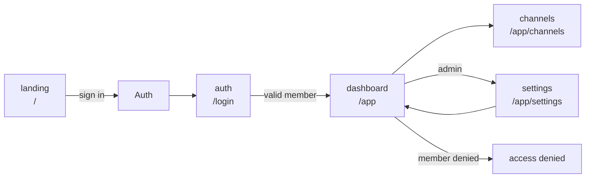

# Sample UWE Navigation Model

This synthetic model shows how a screenshot-backed UWE atlas can represent navigable app states, access branches, and process actions.

## Purpose

Provide a small working example of the UWE navigation pattern that can be copied into target repos and replaced with real app routes and screenshots.

## Source Model

## UWE Facet Mapping

| Node | Content | Navigation | Presentation | Process | Access | Adaptation |
| --- | --- | --- | --- | --- | --- | --- |
| landing | marketing copy | public entry | landing screenshot | get started | anonymous | desktop/mobile variants |
| auth | credential fields | login route | auth screenshot | authenticate | anonymous to member | password recovery branch |
| dashboard | community/channel data | authenticated hub | dashboard screenshot | open channels/settings | member/admin | role-specific nav |
| settings | settings data | admin branch | not captured | update settings | admin only | feature flags |

## Screenshot Evidence

| Node | Evidence |
| --- | --- |
| landing | `generated/review/evidence/sample-uwe-atlas/landing.svg` |
| auth | `generated/review/evidence/sample-uwe-atlas/auth.svg` |
| dashboard | `generated/review/evidence/sample-uwe-atlas/dashboard.svg` |
| settings | evidence gap |

## Invariants

- Navigation nodes should map to user-reachable route or UI states.
- Each node should have screenshot evidence or an explicit gap.
- Role-sensitive links must show allowed and denied branches.
- Process actions should link to expected side effects in the product atlas.
- Synthetic evidence must be labelled as synthetic.

## Freshness

Update this model when the sample product atlas, screenshot evidence, or UWE atlas template changes.
