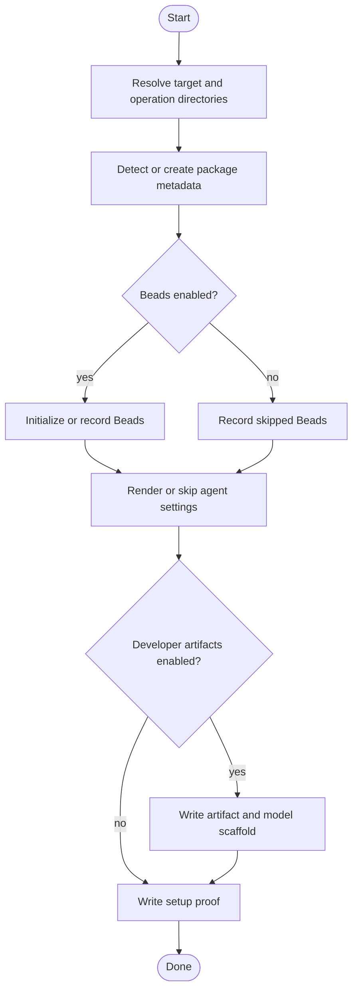

# Setup Project Activity

This activity model tracks the high-level execution path for `skill-harness setup-project`.

## Purpose

Capture the concrete setup-project control flow, including early exits and optional capability branches.

## Scope

The activity includes target resolution, monorepo scope handling, package manager detection, artifact profile and modeling mode resolution, package metadata creation, package installation, Beads setup, Claude settings, developer artifact/model scaffolding, optional `agent-docs` and `noslop` initialization, quality gate installation, setup proof writing, and the install-only early-exit path.

## Source Model

## Evidence

The unit tests exercise scaffold creation, package scripts, policy checks, model review generation, and browser opener discovery in temporary repositories.

## Freshness

Update this model when setup-project adds or removes branches, changes default profiles, or changes setup proof contents.
