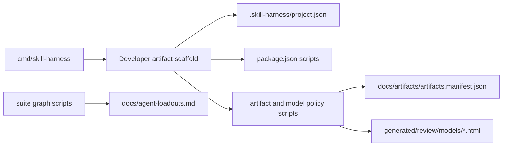

# Scaffold Engine Component View

The scaffold engine combines Go CLI behavior with repo-local scripts. Go writes target project defaults; scripts check and render repo-local evidence.

## Purpose

Show the design-level components that collaborate to scaffold and verify suite outputs.

## Scope

Included components are the CLI command router, dependency/loadout readers, install orchestrator, project setup orchestrator, developer artifact scaffold writer, model policy/review script emitters, Beads worktree wrapper installer, Python helper scripts, agent template sources, target repo filesystem, and external command dependencies.

## Source Model

## Responsibility Split

Go owns portable project setup. Node scripts own artifact and HTML checks because target projects commonly already have Node for package scripts. Python scripts own suite graph generation because existing suite maintenance scripts are Python.

## Evidence

Evidence comes from the Go CLI, Node artifact scripts, Python suite scripts, loadout JSON, dependency JSON, and generated agent templates.

## Freshness

Update this model when scaffold writers, suite graph scripts, agent rendering scripts, or target repo output contracts change.
