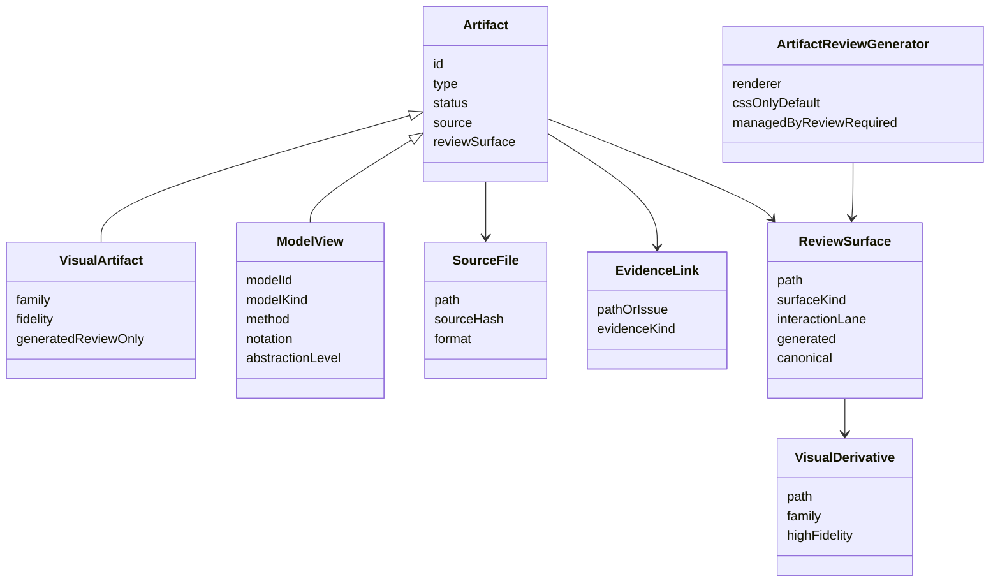

# Artifact Governance Domain Model

The artifact domain keeps canonical source, generated review surfaces, and evidence separate so humans can review rich material without losing diffable source control.

## Purpose

Define the vocabulary and invariants for source-backed developer artifacts, visual review surfaces, and model views.

## Scope

This is a governance/domain model, not a Go type map. It covers artifact profile, visual-source-first policy, modeling mode, model inventory, manifest artifacts, review surfaces, setup proof, evidence links, update triggers, and ownership.

## Source Model

## Invariants

- Every ready artifact names a canonical source.
- Every ready artifact has concrete evidence.
- Product, business, data, research, UX, planning, discovery, and mockup review artifacts keep agent-readable source separate from generated visual derivatives.
- High-fidelity review is required for UI and customer-facing workflow approval surfaces; low-fidelity sketches are scratch unless recorded as evidence.
- Every model view records method, notation, owner, touchpoints, and freshness.
- HTML review files are generated from source and checked for drift.
- Non-model artifacts that set `reviewRequired: true` are generated through the generic artifact review generator.
- Default HTML interaction is CSS-only. Inline JavaScript requires an explicit reviewed lane, manifest metadata, and policy/checker support before use.
- Synthetic user or agent-simulation evidence is labelled separately from real user/customer evidence.
- Host-specific opening is transport only: `open-artifact-review.mjs` resolves the review target, while Codex Browser, Claude preview, system browser, or a local HTTP server provides the human viewing surface.

## Evidence

Evidence comes from `docs/developer-artifacts.md`, `.skill-harness/project.json`, the manifest, the visual-source scaffold implementation, and the model-to-code planning artifact.

## Freshness

Update this model when artifact manifest schema, visual-source-first policy, model metadata requirements, HTML safety policy, interaction lane policy, or generated review semantics change.
