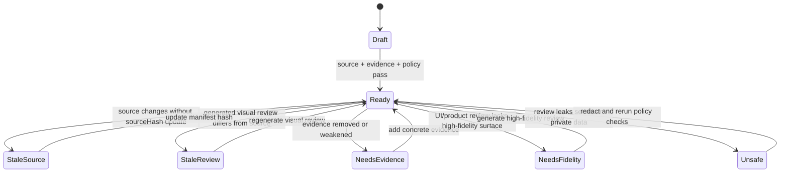

# Artifact Freshness State Model

Artifact freshness is a state machine over source, manifest metadata, generated visual review surfaces, and evidence.

## Purpose

Define how a source-backed artifact moves between draft, ready, stale, evidence-deficient, unsafe, and inconclusive states.

## Scope

This state model applies to source-backed artifacts listed in `docs/artifacts/artifacts.manifest.json`, including UML-first model views and visual-source-first product, business, data, research, UX, and mockup artifacts.

## Source Model

## CI Gate

CI runs manifest checks, model policy checks, generated review drift checks, HTML safety checks, suite drift checks, Go tests, Python syntax checks, and a hermetic setup-project smoke.

## Evidence

Evidence comes from manifest source hashes, generated review drift checks, model policy checks, visual-source policy metadata, HTML policy checks, and CI workflow results.

## Freshness

Update this model when readiness verdicts, sourceHash behavior, model review generation, visual-source-first policy, or CI gate ordering changes.

| Lifecycle state | Derived drift verdict |
| --- | --- |
| Draft | `needs-source` or `inconclusive` |
| Ready | `aligned` |
| Stale | `source-missing`, `mapping-missing`, `evidence-stale`, or `review-stale` |
| NeedsEvidence | `needs-evidence` |
| NeedsFidelity | `mapping-missing` or `review-stale` |
| Unsafe | `unsafe` |
| Inconclusive | `inconclusive` |
