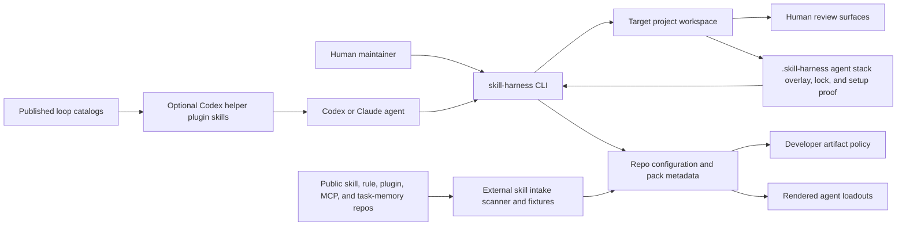

# Skill Harness System Context

`skill-harness` is the suite entrypoint for installing and rendering the 45ck agent and skill stack into target environments. It coordinates local pack metadata, external dependency references, Codex and Claude agent templates, optional Codex helper-plugin skills, Beads-aware project setup, agent-native bootstrap overlays, external skill ecosystem intake, and source-backed developer artifacts, including visual-source-first product, business, data, research, UX, and model review surfaces.

## Purpose

Show the system boundary around `skill-harness` as an installer, renderer, and scaffold engine.

## Scope

Included actors and externals are maintainers, agents, target repos, package managers, `agent-docs`, `noslop`, `bd`, external pack repos, public skill/rule/plugin/MCP ecosystems, published loop catalogs, embedded packs, optional helper plugins, home agent directories, repo-local `.skill-harness/` state, test fixtures, and generated artifact directories. Embedded packs include core toolkit packs such as `specgraph-skills` and `noslop-skills` plus suite-local workflow packs. Target repo runtime behavior is out of scope.

## Source Model

## Boundary

The harness owns suite setup, rendering, resolved agent-stack locks, setup proof, repo-local artifact policy, optional helper-plugin guidance, and synthetic external ecosystem fixtures. Target projects own their canonical product, business, data, research, UX, model, and generated evidence sources. Generated HTML is review material, not canonical source. Public third-party ecosystems and published loop catalogs remain outside the live dependency path until a reviewed first-party rewrite or explicit fixture decision exists; catalog prompts are reference data and do not grant runtime authority.

## Evidence

Evidence comes from `AGENTS.md`, `scripts/dependencies.json`, `scripts/agent_loadouts.json`, `plugins/skill-harness-helpers/`, the intake scanner fixtures, and the setup-project implementation.

## Freshness

Update this model when CLI command boundaries, pack dependencies, helper plugin behavior, agent rendering behavior, external ecosystem intake behavior, or developer artifact policy changes.
