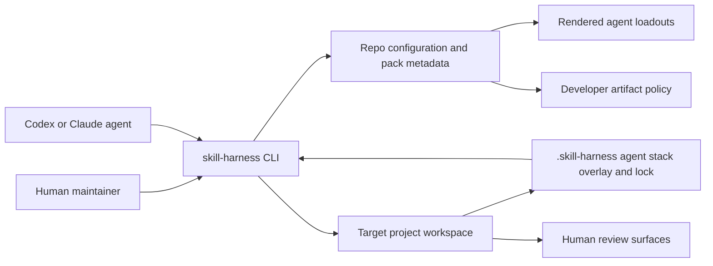

# Skill Harness System Context

`skill-harness` is the suite entrypoint for installing and rendering the 45ck agent and skill stack into target environments. It coordinates local pack metadata, external dependency references, Codex and Claude agent templates, Beads-aware project setup, agent-native bootstrap overlays, and source-backed developer artifacts, including visual-source-first product, business, data, research, UX, and model review surfaces.

## Purpose

Show the system boundary around `skill-harness` as an installer, renderer, and scaffold engine.

## Scope

Included actors and externals are maintainers, agents, target repos, package managers, `agent-docs`, `noslop`, `bd`, external pack repos, embedded packs, home agent directories, repo-local `.skill-harness/` state, and generated artifact directories. Embedded packs include core toolkit packs such as `specgraph-skills` and `noslop-skills` plus suite-local workflow packs. Target repo runtime behavior is out of scope.

## Source Model

## Boundary

The harness owns suite setup, rendering, and repo-local artifact policy. Target projects own their canonical product, business, data, research, UX, model, and generated evidence sources. Generated HTML is review material, not canonical source.

## Evidence

Evidence comes from `AGENTS.md`, `scripts/dependencies.json`, `scripts/agent_loadouts.json`, and the setup-project implementation.

## Freshness

Update this model when CLI command boundaries, pack dependencies, agent rendering behavior, or developer artifact policy changes.
