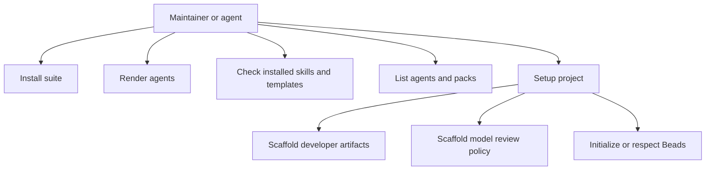

# CLI Workflow Use Cases

The CLI supports maintainers and agents that need to inspect, install, render, check, and scaffold project capabilities.

## Purpose

Show the user goals that the CLI exposes to repo maintainers and agent operators.

## Scope

Top-level use cases are install full suite, install selected packs, install selected agents, run interactive install, set up a project, validate dependencies, render agents, install Beads worktrees, uninstall agents, and open artifact review. Flag variants are extensions unless they materially change behavior.

## Source Model

## Use-Case Notes

`setup-project` is the workflow most tightly coupled to developer artifacts. It creates repo-local policy, scripts, proof files, source directories, and review surfaces while respecting flags that skip Beads, agent-docs, Claude settings, or modeling.

## Evidence

Evidence comes from `cmd/skill-harness/main.go`, CLI tests, `README.md`, and `docs/developer-artifacts.md`.

## Freshness

Update this model when commands, setup flags, package scripts, or artifact-opening behavior change.
