# CLI Workflow Use Cases

The CLI supports maintainers and agents that need to inspect, resolve, install, render, check, scaffold, audit, bootstrap, and update project capabilities.

## Purpose

Show the user goals that the CLI exposes to repo maintainers and agent operators.

## Scope

Top-level use cases are install full suite, install selected packs, install selected agents, run interactive install, resolve an agent stack overlay, bootstrap agent-native repo state, initialize repo baseline governance, audit repo adoption state, check drift, sync baseline lock/report files, check available baseline updates, dry-run trim suggestions, set up a project, validate dependencies, render agents, install Beads worktrees, uninstall agents, and open artifact review. Flag variants are extensions unless they materially change behavior.

## Source Model

```mermaid
flowchart TD
  Maintainer["Maintainer or agent"] --> Install["Install suite"]
  Maintainer --> Render["Render agents"]
  Maintainer --> Check["Check installed skills and templates"]
  Maintainer --> List["List agents and packs"]
  Maintainer --> ResolveStack["Resolve agent stack overlay"]
  Maintainer --> Bootstrap["Bootstrap agent-native repo"]
  Maintainer --> Audit["Audit project adoption state"]
  Maintainer --> RepoInit["Initialize repo baseline governance"]
  Maintainer --> RepoAudit["Audit repo baseline surfaces"]
  Maintainer --> RepoDrift["Check repo drift"]
  Maintainer --> RepoUpdate["Check baseline updates"]
  Maintainer --> RepoTrim["Dry-run trim suggestions"]
  Maintainer --> RepoSync["Sync lock and update report"]
  Maintainer --> UpdateProject["Update project lock state"]
  Maintainer --> Setup["Setup project"]
  ResolveStack --> EffectiveState["Effective agents, packs, skills, and diagnostics"]
  Bootstrap --> StackConfig[".skill-harness/agent-stack.json"]
  UpdateProject --> StackLock[".skill-harness/agent-stack.lock.json"]
  RepoInit --> BaselineManifest[".skill-harness/baseline.manifest.json"]
  RepoAudit --> BaselineManifest
  RepoDrift --> BaselineManifest
  RepoUpdate --> BaselineManifest
  RepoTrim --> BaselineManifest
  RepoSync --> BaselineLock[".skill-harness/baseline.lock.json"]
  RepoSync --> UpdateReport[".skill-harness/update-report.json"]
  Setup --> Artifacts["Scaffold developer artifacts"]
  Setup --> StackConfig
  Setup --> Models["Scaffold model review policy"]
  Setup --> Beads["Initialize or respect Beads"]
```

## Use-Case Notes

`setup-project` is the workflow most tightly coupled to developer artifacts. It creates repo-local policy, scripts, proof files, source directories, review surfaces, and a default agent stack overlay while respecting flags that skip Beads, agent-docs, Claude settings, or modeling.

Agent-native commands keep setup prompt-first. `resolve` is read-only, `bootstrap --agent-native` creates local desired state without package installs, `install --dir`, `render --dir`, and `check --dir` consume resolved state when no explicit selections are passed, and `update-project --write-lock` records the resolved baseline state for future reconciliation.

Repo governance commands add a project-safe distribution layer over the agent stack. `repo init` creates `.skill-harness/baseline.manifest.json`; `repo audit` reports managed, overlay, owned, generated, ignored, and missing surfaces; `repo drift` fails on warning/error findings; `repo sync` refreshes lock and update-report files only; `repo update --check` and `repo trim --dry-run` are observe-only paths for accepting baseline improvements and reducing unused agents or packs.

## Evidence

Evidence comes from `cmd/skill-harness/main.go`, CLI tests, `README.md`, and `docs/developer-artifacts.md`.

## Freshness

Update this model when commands, setup flags, package scripts, or artifact-opening behavior change.
