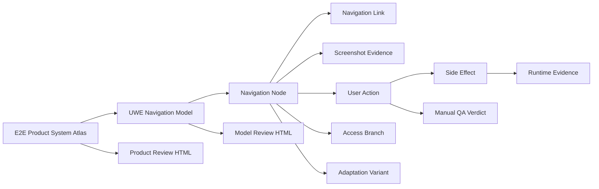

# Skill Harness UWE Navigation Atlas Model

This model defines the Skill Harness pattern for creating a UWE navigation model with screenshot-backed review evidence.

## Purpose

Show how an E2E Product System Atlas is structured without creating a giant whole-system UML diagram. Navigation is the model spine; screenshots, QA evidence, runtime effects, and access/adaptation branches attach to navigation nodes and actions.

## Scope

This model covers the artifact workflow that Skill Harness scaffolds for target apps. It does not model any target app's real routes. Target repos own their app-specific UWE navigation sources, screenshot evidence, QA verdicts, and runtime evidence.

## Source Model

## UWE Facets

| Facet | Atlas responsibility |
| --- | --- |
| Content | records, product concepts, user-visible data, files, media, and API/data shapes tied to nodes |
| Navigation | routable states, role-specific links, menus, redirects, guarded branches, and external entry points |
| Presentation | screenshots, responsive captures, empty/loading/error/success states, and component-level evidence |
| Process | form submissions, multi-step workflows, background tasks, and workflow state transitions |
| Access | authentication, authorization, tenant boundaries, denied states, and data visibility |
| Adaptation | feature flags, personalization, tenant variants, locale/device differences, and rollout states |

## Invariants

- The navigation model is bounded by discovered user-reachable routes and states.
- Each ready atlas names scope, roles, entry points, exclusions, and authorization limits.
- Each navigation node should have screenshot evidence or a documented evidence gap.
- Each primary action should have expected UI result, data effect, runtime effect, evidence, and verdict.
- Untested or inconclusive branches are explicit.
- Generated HTML, screenshots, SVGs, videos, and comparison pages are review surfaces only.
- App-specific target repos own app-specific route evidence and screenshots.

## Evidence

Evidence comes from the E2E Product System Atlas workflow source, the generated review pipeline, the manifest metadata contract, and the developer artifact policy.

## Freshness

Update this model when the atlas template, screenshot embedding behavior, visual-source-first policy, UWE facet guidance, or manual QA evidence contract changes.
